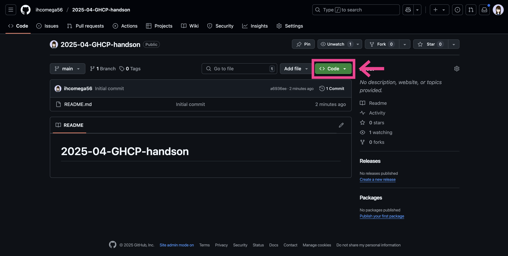
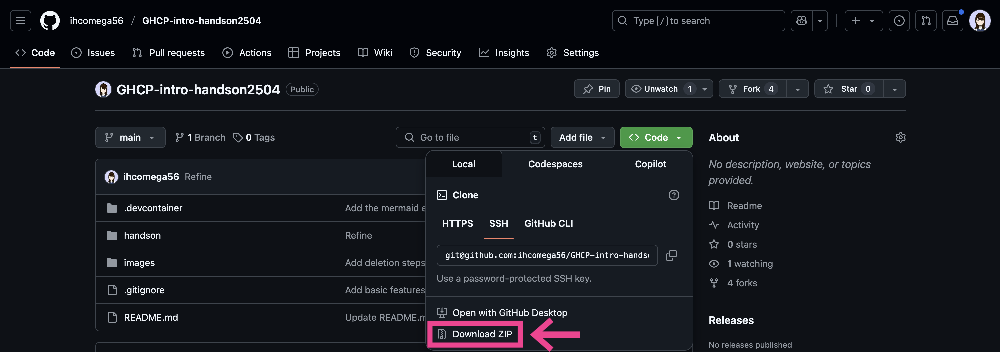

# GHCP-intro-handson2504

GitHub Copilotをこれから活用したい方向けのハンズオンです。
ハンズオン用資料とソースコード、サンプルアプリケーションの実行方法は[handsonディレクトリ](https://github.com/ihcomega56/GHCP-intro-handson2504/tree/main/handson)内にあります。

## 事前準備

ローカル環境で本ハンズオンを実施するための手順です。既にインストール済みのものはスキップしてください。

1.  [Visual Studio Code](https://code.visualstudio.com/download) をインストールします。なるべく最新バージョンを推奨しますが、最低限Copilot Chatが使用できることをご確認ください。
1. リポジトリをローカルに取得します。
    -  【Gitを使う場合】[Gitをインストール](https://git-scm.com/book/ja/v2/%E4%BD%BF%E3%81%84%E5%A7%8B%E3%82%81%E3%82%8B-Git%E3%81%AE%E3%82%A4%E3%83%B3%E3%82%B9%E3%83%88%E3%83%BC%E3%83%AB)し、[本リポジトリ](https://github.com/ihcomega56/GHCP-intro-handson2504) をクローンします。
    -  【Gitを使わない場合】[本リポジトリ](https://github.com/ihcomega56/GHCP-intro-handson2504)  をZIPダウンロードします。
        1. 自分のアカウントのリポジトリ上で右上の **'Code' ボタンをクリック** します。
            
        1. **'Download ZIP' ボタンをクリック** します。
            
1. クローンまたはZIPダウンロード・展開したフォルダを Visual Studio Code で開きます。左上のメニューで **ファイル** -> **フォルダーを開く** と選択し、フォルダを選択してください。

## Codespaces・フォークをお使いいただいた方へご案内
[Codespaceおよびフォークしたリポジトリを削除する手順](https://github.com/ihcomega56/GHCP-intro-handson2504/blob/main/how-to-clean-up-github.md)をご参照ください。