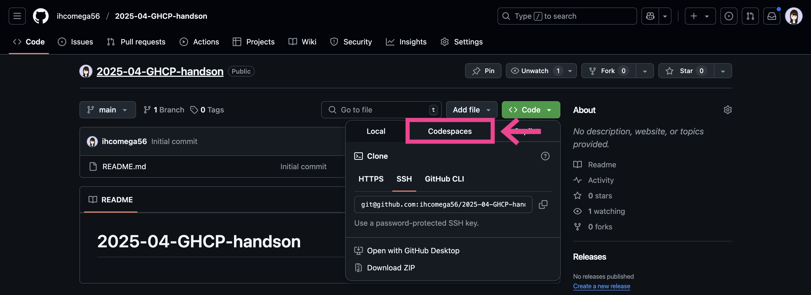
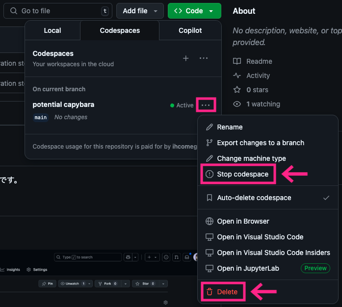
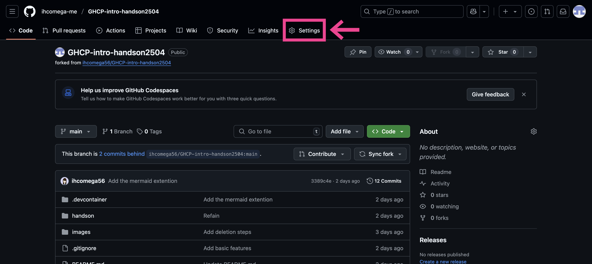
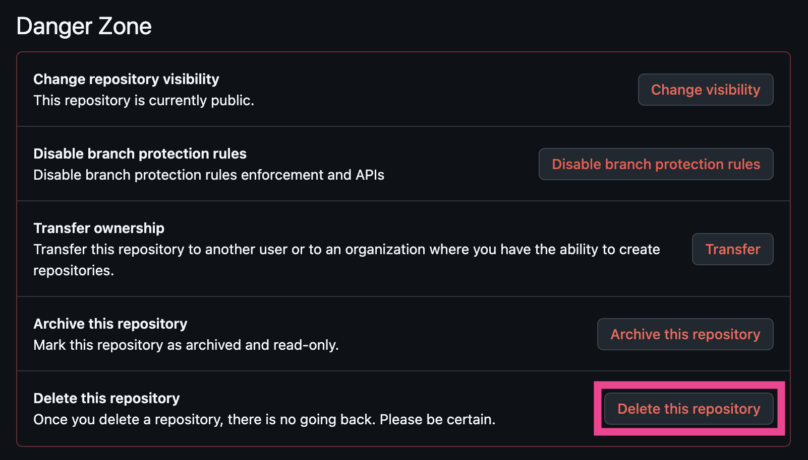
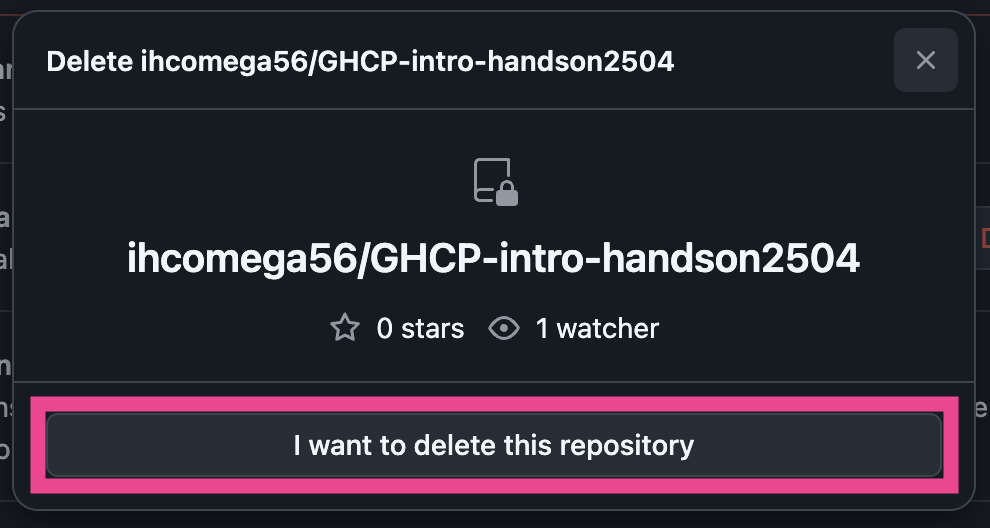
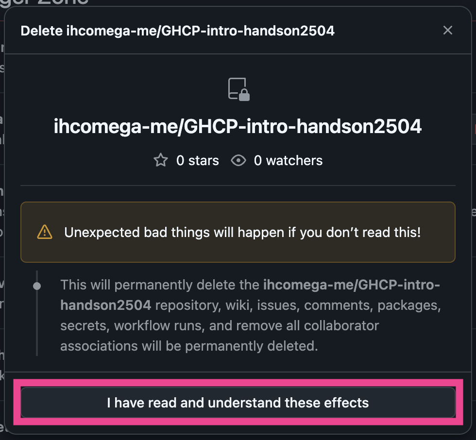
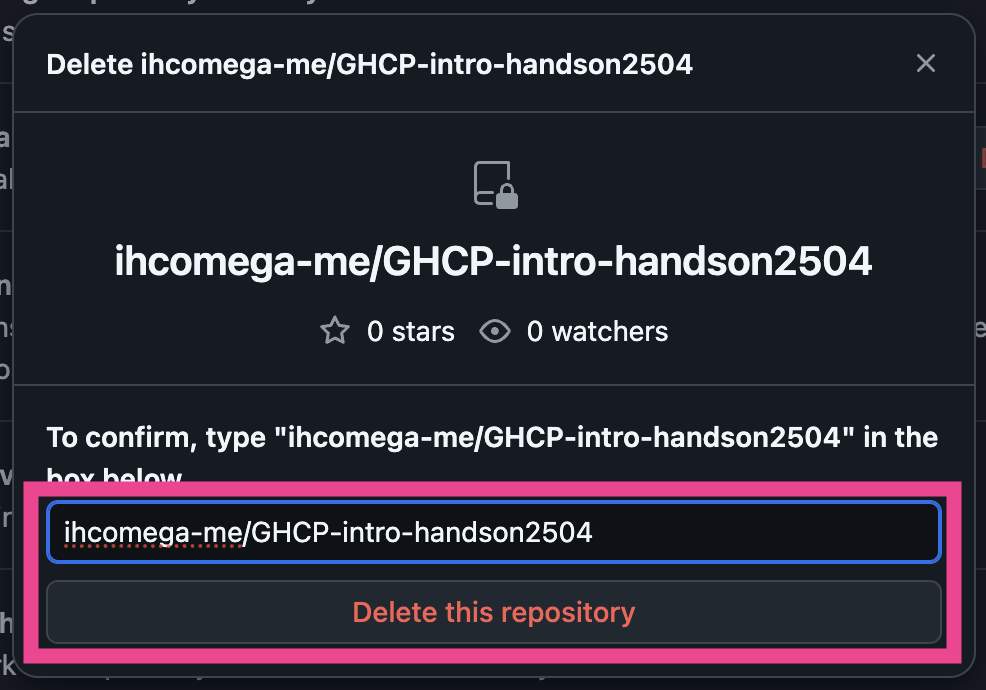

## Codespacesの削除

1. 自分のアカウントのリポジトリ上で右上の **'Code' ボタンをクリック** します。
    
1. **'Codespaces' タブをクリック** します。
    
1. アクティブなCodespace の隣にある **メニュー（三点リーダのような形）をクリック** します。
1. Codespacesを停止したい場合は **'Stop Codespace' をクリック**、削除したい場合は **'Delete' をクリック** します。消えたら困る途中の作業がない限り、 'Delete' を選択して構いません。
    

## フォークしたリポジトリの削除

1. フォークしたリポジトリの **Settings** を開きます。
    
1. ページ最下部 **Danger Zone** までスクロールし、**'Delete this repository' をクリック** します。
    
1. **'I want to delete this repository' をクリック** します。
    
1. **'I have read and understand these effects' をクリック** します。
    
1. 入力欄に `{使用しているGitHubアカウント名}/GHCP-intro-handson-2504` と入力し、 **'Delete this repository' をクリック** します。
    